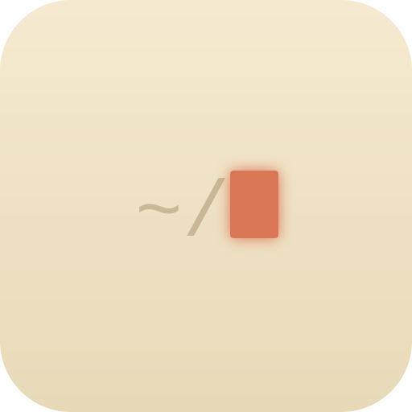

<p align="center">
  
</p>

<h1 align="center">dotfiles</h1>

Personal config for macOS — Ghostty terminal, zsh, Neovim, tmux, lazygit, Claude Code — with a portable subset for Linux/WSL2 and a narrow Windows entry point.

The design rationale (what is versioned vs. per-machine, and why every non-obvious line is the way it is) lives in [`CLAUDE.md`](CLAUDE.md). This README is the map.

## What's here

| Path | What |
|---|---|
| `zsh/.zshrc` | Interactive shell config (no framework — startup ~50ms) |
| `zsh/.zshenv` | Env vars and PATH, loaded by every zsh, non-interactive included |
| `zsh/functions.zsh` | Shell functions, incl. `claude --api` / `code --api` (run through the API gateway, see below) |
| `ghostty/` | Ghostty config (`config.ghostty`) + `themes/` (the palettes of the cross-stack theme) |
| `nvim/` | Neovim config — lazy.nvim, modular `lua/plugins/*` (one file per plugin), `lua/themes/*` for the stack theme. Cheatsheet: `nvim/CHEATSHEET.md` |
| `tmux/` | tmux config — prefix `C-t`, single-chord popups `Alt+c/C/a/A/y/u/d/g/Enter`, modular (theme / statusline / utility / `themes/`). Cheatsheet: `tmux/CHEATSHEET.md` |
| `lazygit/config.yml` | lazygit theme + custom commands |
| `git/.gitignore_global` | Global gitignore — macOS noise, editor files, build dirs, **and AI-agent scratch** (`.claude/`, `.cursor/`, `.aider*`, …), excluded in every repo |
| `scripts/` | `ide` (4-pane tmux layout, `prefix + g`), `claude-api-env` (runs a command with the gateway env), `lib.sh` (shared by both bash installers). The first two are symlinked onto `~/.local/bin` |
| `claude/` | User-level Claude Code pieces — `CLAUDE.md` (→ `~/.claude/CLAUDE.md`), `statusline.{sh,ps1}`, `hooks/bitacora.{sh,ps1}`, the `bitacora` and `wiki` skills, and `install/` (everything the installers do to `~/.claude/`, see its README) |
| `install.sh` | macOS entry point — symlinks + Homebrew deps + Claude Code setup |
| `install-linux.sh` | Ubuntu/Debian/WSL2 — same symlinks minus Ghostty; apt + GitHub release binaries |
| `install-windows.ps1` | Native Windows — Claude Code pieces, Nerd Fonts and the theme for Windows Terminal only |
| `.github/workflows/lint.yml` | CI: shellcheck + `bash -n` / `zsh -n`, Lua and JSON syntax, PowerShell parse. Static only — nothing installs |

## Setup on a new machine

Prerequisite: **Homebrew**. If you don't have it:

```bash
/bin/bash -c "$(curl -fsSL https://raw.githubusercontent.com/Homebrew/install/HEAD/install.sh)"
```

Then:

```bash
git clone https://github.com/mgaliciat/dotfiles.git ~/dotfiles
cd ~/dotfiles
./install.sh
```

`install.sh` is idempotent — re-run it after every `git pull`. It backs up anything it would overwrite as `<file>.backup.<timestamp>` and then:

1. **Symlinks** `.zshrc`, `.zshenv`, `.gitignore_global`, ghostty (config + themes), nvim, tmux, lazygit, `~/.local/bin/{ide,claude-api-env}`, and the Claude pieces (`~/.claude/CLAUDE.md`, `statusline.sh`, `hooks/bitacora.sh`, `skills/bitacora`, `skills/wiki`).
2. **Installs missing Homebrew deps** (see `REQUIRED_FORMULAE` / `REQUIRED_CASKS` in the script): the zsh plugins, `eza`, `bat`, `fd`, `ripgrep`, `gomi`, `zoxide`, `fzf`, `jq`, `gh`, `git-delta`, `pyenv`, `neovim`, `tree-sitter-cli`, `tmux`, `lazygit`, `rtk`; casks `ghostty`, `1password-cli` and the fonts `config.ghostty` names. Paper Mono has no cask and is fetched from its GitHub release.
3. **Configures Claude Code** — all additive-only, nothing you set by hand on that machine is clobbered. Split by who writes `~/.claude/settings.json` (`claude/install/README.md`): our `jq` merges (statusline, base permissions, no attribution trailer, the bitácora `PostToolUse` hook), the external binaries' own setup ([`rtk`](https://github.com/rtk-ai/rtk), [`codebase-memory-mcp`](https://github.com/DeusData/codebase-memory-mcp), the `context7` and `open-knowledge` MCP endpoints, the `gh-stack` skill), and the plugin CLI (currently nothing).
4. **Bootstraps tmux** — clones tpm if missing, pins `tmux-claude-session-manager` to a commit, reloads the config if a server is running. Inside tmux: `prefix + I` installs the rest of the plugins the first time.
5. Installs the `gh-stack` extension for `gh`.
6. Registers VS Code as the default app for `.ghostty` files (if VS Code is installed).

Then `exec zsh`.

**`~/.gitconfig` is neither versioned nor symlinked** — each machine keeps its own (credentials, 1Password vaults, signing keys). Copy it from wherever you backed it up.

**Caps Lock → Option** is set in System Settings → Keyboard → Keyboard Shortcuts → Modifier Keys (per-device, not versioned).

## Sync an existing machine

After a `git pull`, files are already current through the symlinks, **but running tools still hold the old config in memory**:

| Changed | How to apply |
|---|---|
| `zsh/*` | `exec zsh` in every open terminal |
| `ghostty/*` | `Cmd+Shift+R` (*Reload Configuration*). **New `keybind`s need a full quit + relaunch** |
| `tmux/*` | `./install.sh` does it; or `tmux source ~/.config/tmux/tmux.conf` |
| `nvim/*` | Restart nvim (`:Lazy reload <plugin>` for a single plugin) |
| `lazygit/*` | Reopen lazygit |
| `install*.sh`, `claude/install/*` | Re-run `./install.sh` |

## The stack theme

One theme id spans Ghostty, nvim and tmux (and Windows Terminal, derived from the Ghostty file at install time). Selection is a versioned value in each config — change the three lines, commit, pull on the other machines:

- `ghostty/config.ghostty` → `theme = <id>`
- `nvim/lua/config/options.lua` → `vim.g.theme = "<id>"`
- `tmux/tmux.conf` → `source ~/.config/tmux/themes/<id>.conf`

Currently `solarized-osaka`. The family and each theme's provenance are documented in `CLAUDE.md` ("The stack theme"); the palettes live in `ghostty/themes/`, `nvim/lua/themes/`, `tmux/themes/`.

## Claude Code through an API gateway

`claude --api …` and `code --api …` (zsh functions) run the real binary with the `ANTHROPIC_*` variables from `~/.claude/claude-api.env`, for that one process only; without the flag both are untouched. `Alt+a` / `Alt+A` in tmux are the gateway twins of `Alt+c` / `Alt+C`. All of it goes through `scripts/claude-api-env`, which *parses* the file (never `source`s it) and refuses to launch without `ANTHROPIC_BASE_URL`.

The env file holds a credential: per-machine, `chmod 600`, never versioned, and no installer creates it. A machine without one simply has no gateway.

## Per-machine config (not versioned)

- **`~/.gitconfig.local`** — git identity (`user.name`, `user.email`, signing key). Your `~/.gitconfig` includes it via `[include]` at the end, so it wins.
- **`~/.zshrc.local`** — aliases/functions for this machine only; sourced last by `.zshrc`.
- **`~/.zshenv.local`** — secrets (API keys, DB passwords), sourced last by `.zshenv`:

  ```sh
  # ~/.zshenv.local — never commit
  export PG_PASSWORD="..."
  export CONTEXT7_API_KEY="..."
  ```

- **`~/.claude/claude-api.env`** — the gateway credential (see above). Deliberately *not* in `.zshenv.local`: that file is exported into every process the shell spawns, this one is read by a single launch.
- **`~/.claude/settings.json`**, **`~/.claude/skills/`** (except the two we version), **`~/.claude/projects/*/memory/`** — Claude Code state. Permissions and UI prefs diverge per host; skills and memories are written by Claude Code and its binaries at runtime. `install.sh` only does guarded, additive merges into `settings.json`. If you delete `~/.claude` entirely, re-running `./install.sh` rebuilds everything the binaries install; your permissions and memories don't come back — they never lived in the repo.
